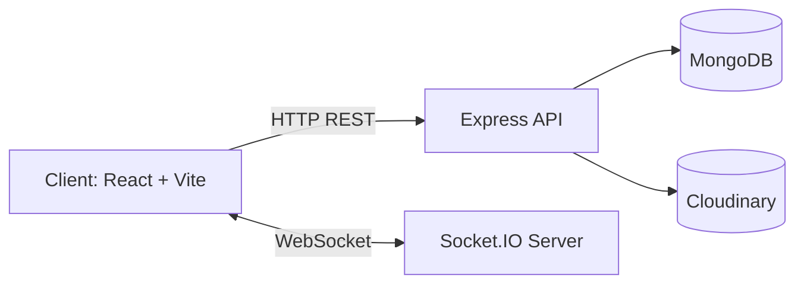

# Chat App (Full-Stack Real-Time Messaging)

A full-stack real-time chat application built with **React + Vite** on the frontend and **Node.js + Express + Socket.IO + MongoDB** on the backend.

This README documents the **entire project** (both `client` and `server`) including system design, structure, setup, and key implementation details.

---

## 1) Project Highlights (Speciality)

- **Real-time communication** using Socket.IO (online presence + instant message delivery)
- **Conversation-centric storage model** using `conversationId` for efficient history retrieval
- **Seen/unseen message tracking** for sidebar unread indicators
- **JWT-based authentication** with protected backend routes
- **Cloudinary image upload support** for profile images and chat media
- **Optimized DB indexing** for faster chat fetch and unseen query checks

---

## 2) High-Level System Design

### Architecture



### Request & Data Flow

1. User logs in/signup from frontend.
2. Server validates credentials, returns JWT token + user payload.
3. Frontend stores token and sends it in `token` request header for protected APIs.
4. Frontend opens Socket.IO connection with `userId` in handshake query.
5. Server tracks online users (`userSocketMap`) and broadcasts presence updates.
6. Sending a message writes to MongoDB and emits a socket event to recipient if online.
7. Sidebar API calculates unseen counts per contact and returns map data.

---

## 3) Tech Stack

### Frontend (`client`)

- React 19
- Vite 7
- React Router
- Tailwind CSS v4
- Axios
- Socket.IO Client
- React Hot Toast

### Backend (`server`)

- Node.js (ES Modules)
- Express 5
- Socket.IO
- MongoDB + Mongoose
- JWT (`jsonwebtoken`)
- `bcryptjs`
- Cloudinary
- CORS + dotenv

---

## 4) Project Folder Structure

```text
chat-app/
├─ README.md
├─ client/
│  ├─ package.json
│  ├─ vite.config.js
│  ├─ eslint.config.js
│  ├─ index.html
│  ├─ public/
│  └─ src/
│     ├─ App.jsx
│     ├─ main.jsx
│     ├─ App.css
│     ├─ index.css
│     ├─ assets/
│     │  └─ assets.js
│     ├─ components/
│     │  ├─ Sidebar.jsx
│     │  ├─ ChatContainer.jsx
│     │  └─ RightSidebar.jsx
│     ├─ context/
│     │  ├─ AuthContext.jsx
│     │  ├─ AuthContextProvider.js
│     │  ├─ ChatContext.jsx
│     │  └─ ChatContextProvider.js
│     ├─ lib/
│     │  └─ utils.js
│     └─ pages/
│        ├─ HomePage.jsx
│        ├─ LoginPage.jsx
│        └─ ProfilePage.jsx
└─ server/
   ├─ package.json
   ├─ server.js
   ├─ controllers/
   │  ├─ userController.js
   │  └─ messageController.js
   ├─ middleware/
   │  └─ auth.js
   ├─ models/
   │  ├─ user.js
   │  └─ Messages.js
   ├─ route/
   │  ├─ userRoutes.js
   │  └─ messageRoutes.js
   └─ lib/
      ├─ db.js
      ├─ cloudinary.js
      └─ utils.js
```

---

## 5) Backend API Design

### Auth Routes (`/api/auth`)

- `POST /signup` → Create account
- `POST /login` → Login and return JWT
- `PUT /update-profile` → Update name/bio/profile image (**protected**)
- `GET /check` → Validate token and fetch current user (**protected**)

### Message Routes (`/api/messages`)

- `GET /users` → Sidebar users + unseen counts (**protected**)
- `GET /:id` → Conversation history with selected user (**protected**)
- `POST /send/:id` → Send text/image message to selected user (**protected**)
- `PUT /mark/:id` → Mark message as seen (**protected**)
- `DELETE /:id` → Delete own message (**protected**)

### Status Route

- `GET /api/status` → Simple health response

---

## 6) Database Design (Core Models)

### `User`

- `email` (unique)
- `fullName`
- `password` (hashed)
- `profilePic`
- `bio`
- timestamps

### `Message`

- `conversationId` (ordered sender/receiver composite key)
- `senderId` (ref `User`)
- `receiverId` (ref `User`)
- `text`
- `image`
- `seen` (boolean)
- timestamps

### Important Indexes

- `{ conversationId: 1, createdAt: 1 }`
- `{ conversationId: 1, receiverId: 1, seen: 1 }`

These improve conversation sorting and unseen message checks.

---

## 7) Real-Time Design (Socket.IO)

### Server responsibilities

- Tracks active sockets in `userSocketMap` (`userId -> socketId`)
- Broadcasts online user list using `getOnlineUsers`
- Emits new message events to recipient socket when available

### Client responsibilities

- Connects socket after auth success
- Keeps local `onlineUsers` in auth context
- Subscribes to message events for real-time chat updates
- Updates unseen counters when message belongs to non-selected conversation

---

## 8) Environment Variables

Create `server/.env` with:

```env
PORT=5000
MONGODB_URL=<your_mongodb_base_url>
JWT_SECRET=<your_jwt_secret>
CLOUDINARY_CLOUD_NAME=<your_cloudinary_cloud_name>
CLOUDINARY_API_KEY=<your_cloudinary_api_key>
CLOUDINARY_API_SECRET=<your_cloudinary_api_secret>
```

Create `client/.env` with:

```env
VITE_BACKEND_URL=http://localhost:5000
```

> Note: backend code currently uses `MONGODB_URL` and appends `/chat-app` internally.

---

## 9) Local Development Setup

### 1) Install dependencies

```bash
cd server
npm install

cd ../client
npm install
```

### 2) Run backend (Terminal 1)

```bash
cd server
npm run server
```

If `nodemon` is not installed globally, either install it globally or run:

```bash
npm install --save-dev nodemon
npm run server
```

### 3) Run frontend (Terminal 2)

```bash
cd client
npm run dev
```

Open the URL shown by Vite (commonly `http://localhost:5173`).

---

## 10) Production Build

```bash
cd client
npm run build
npm run preview

cd ../server
npm start
```

For real deployment, host frontend and backend separately and set `VITE_BACKEND_URL` to deployed backend URL.

---

## 11) Security & Reliability Notes

- Passwords are hashed with `bcryptjs` before DB storage.
- JWT-protected routes use middleware validation.
- Sensitive credentials are expected via environment variables.
- Uploads are delegated to Cloudinary instead of local disk storage.

Recommended improvements for production:

- Add JWT expiry + refresh strategy
- Restrict CORS origin (avoid `*`)
- Add request rate limiting and input validation layer
- Add centralized error handler and API response standards

---

## 12) Common Troubleshooting

- **Auth failing**: verify `token` header is sent by client after login.
- **DB not connecting**: check `MONGODB_URL` and network access; ensure `/chat-app` DB path is valid.
- **Real-time events not received**: verify backend URL, socket connection, and event names on both sides.
- **Image upload failing**: verify Cloudinary keys and base64 payload size.

---

## 13) Future Enhancements

- Group chats and channels
- Typing indicators
- Message reactions and replies
- File attachments (PDF/docs)
- Pagination / infinite scroll for long conversations
- Unit/integration tests and CI pipeline

---

## 14) License

This project currently has no explicit top-level license file. Add a `LICENSE` file if you plan to distribute it publicly.
